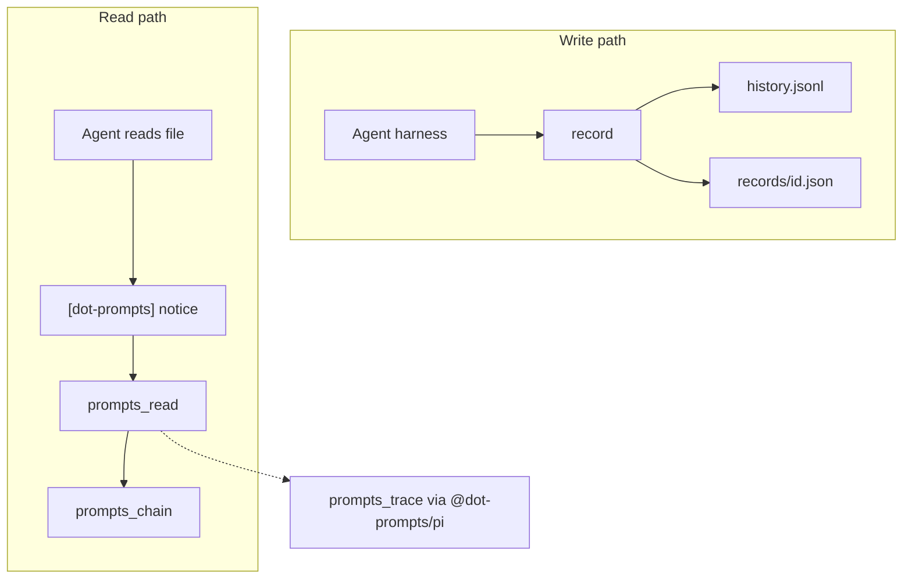

# Architecture

npm workspaces monorepo. Publishable packages:

| Package | Path | Public imports |
|---|---|---|
| `dot-prompts` | `packages/core` | `dot-prompts`, `dot-prompts/mcp` |
| `@dot-prompts/pi` | `packages/pi` | `@dot-prompts/pi` (session-trace + pi package) |
| `@dot-prompts/conformance` | `packages/conformance` | `@dot-prompts/conformance` |

Private stubs: `packages/cursor`, `packages/claude-code`.

```typescript
import { record, lookup, handlePromptsRead } from "dot-prompts";
import { createDotPromptsMcpServer } from "dot-prompts/mcp";
import { handlePromptsTrace } from "@dot-prompts/pi";
```

The default `dot-prompts` entry loads core and tools. MCP SDK and Zod load through `dot-prompts/mcp` and are optional peers. Pi session tracing lives in `@dot-prompts/pi` (not a core subpath). MCP must not import the pi package.

## Core layout (`packages/core/src`)

| Path | Role |
|---|---|
| `core/` | Types, storage port (JSONL), config/`findStore`, record, query, validate, hashline, `promptsDir` |
| `links/` | File / region / symbol / git extraction and notice formatting |
| `provenance/` | `referencedRecords` chain |
| `tools/` | `TOOL_CATALOG` plus `prompts_read` / `prompts_chain` handlers |
| `mcp/` | MCP adapter |
| `cli.ts` | CLI |

Schemas ship from `packages/core/schemas/`.

## Write and read paths



## Storage

Callers talk to a `Storage` port (`append`, `list`, `getById`). `JsonlStorage` is the implementation. Pass `{ promptsDir }`, `{ storage }`, or `{ filePath }` / `{ cwd }` so `findStore` can walk up to `dotprompts.json` or `.prompts/config.json`.

Store discovery: walk up from `filePath` (else `cwd`); prefer `dotprompts.json` then `.prompts/config.json`; stop at `.git` (use `<gitRoot>/.prompts`) or, with no git/config, `<cwd>/.prompts`. CLI `--prompts-dir` and API `{ promptsDir }` skip discovery. Config validates against `schemas/config.v1.json`.

## Tools

`packages/core/src/tools/catalog.ts` is the description and parameter list for every tool name. Adapters choose which tools to register: MCP maps `prompts_read` and `prompts_chain` to Zod; the pi package maps those plus `prompts_trace` to TypeBox. Shared execute logic for read/chain lives in `handlePromptsRead` / `handlePromptsChain`. `prompts_trace` is implemented in `@dot-prompts/pi`.

Records validate against JSON Schema (`packages/core/schemas/`) with Ajv on write.

## Link types

Registry and scoring: [usage/link-types](../usage/link-types.md). To add a type:

1. Definition in `packages/core/schemas/link.v1.json`
2. TypeScript in `packages/core/src/core/types.ts`
3. Scoring in `packages/core/src/core/query.ts`

Experimental pointers that are not a registered link type belong in `metadata`.

## Commands

```bash
npm test
npm run build
```

CI (`.github/workflows/ci.yml`) runs build then test.

Tests: `packages/core/test/`, `packages/pi/test/`, `packages/conformance/test/`.

## Conventions

- Publishable core + adapter packages; session-trace is pi-local (`@dot-prompts/pi`).
- Session pointers live at `metadata[metadata.harness]` (e.g. `metadata.pi.sessionFile`). `formatLookupForAgent` reads those generically.
- Adapters → core; core ↛ adapters; adapters ↛ each other.
- Conformance asserts outcomes (records, notices, catalog), not harness lifecycle APIs.
