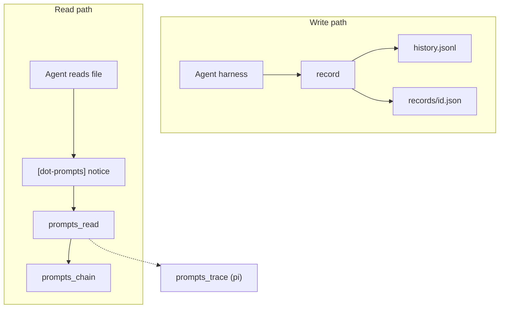

# Architecture

One npm package, `dot-prompts`, with subpath exports. Folders match those exports.

| Path | Role |
|---|---|
| `src/core/` | Types, storage port (JSONL), record, query, validate, hashline, `promptsDir` |
| `src/links/` | File / region / symbol / git extraction and notice formatting |
| `src/provenance/` | `referencedRecords` chain |
| `src/tools/` | `TOOL_CATALOG` plus `prompts_read` / `prompts_chain` handlers |
| `src/mcp/` | MCP adapter |
| `src/pi/` | Pi session trace |
| `src/cli.ts` | CLI |
| `extensions/pi/` | Pi harness (record, notices, tools) |

```typescript
import { record, lookup, handlePromptsRead } from "dot-prompts";
import { createDotPromptsMcpServer } from "dot-prompts/mcp";
import { handlePromptsTrace } from "dot-prompts/pi";
```

The default entry loads core and tools. MCP SDK and Zod load through `dot-prompts/mcp` and are optional peers. Pi session tracing loads through `dot-prompts/pi`. MCP does not import pi.

## Write and read paths



## Storage

Callers talk to a `Storage` port (`append`, `list`, `getById`). `JsonlStorage` is the implementation. Pass `{ promptsDir }` or `{ storage }`.

`.prompts/` resolves the same way everywhere: `--prompts-dir`, then `DOT_PROMPTS_DIR`, then `<cwd>/.prompts`.

## Tools

`src/tools/catalog.ts` is the description and parameter list for every tool name. Adapters choose which tools to register: MCP maps `prompts_read` and `prompts_chain` to Zod; the pi extension maps those plus `prompts_trace` to TypeBox. Shared execute logic lives in `handlePromptsRead` / `handlePromptsChain` (`src/tools/handlers.ts`). The current `prompts_trace` implementation is the pi session loader (`handlePromptsTrace` in `src/pi/handlers.ts`).

Records validate against JSON Schema (`schemas/`) with Ajv on write.

## Link types

Registry and scoring: [usage/link-types](../usage/link-types.md). To add a type:

1. Definition in `schemas/link.v1.json`
2. TypeScript in `src/core/types.ts`
3. Scoring in `src/core/query.ts`

Experimental pointers that are not a registered link type belong in `metadata`.

## Commands

```bash
npm test
npm run build
```

CI (`.github/workflows/ci.yml`) runs build then test.

Core tests live in `test/`. Pi extension tests live in `extensions/pi/test/` (run by the same vitest config).

The pi extension is a nested package (`extensions/pi`, `dot-prompts` via `file:../..`). `npm run build:pi` builds core then installs the extension.

## Conventions

- One published package, with subpath exports as the public boundary.
- Session pointers live at `metadata[metadata.harness]` (e.g. `metadata.pi.sessionFile`). `formatLookupForAgent` reads those generically.
- `prompts_trace` loads the pi session branch from those pointers.
