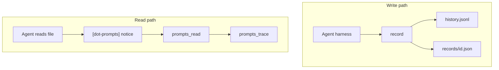

# Overview

dot-prompts records **why** AI agents changed code — not a copy of the code itself.

## Problem

When an agent edits a file, the intent lives in the chat session. That context is lost when:

- A new session starts
- Another developer or agent picks up the work
- Code looks over-engineered without explanation

Git stores *what* changed. dot-prompts stores *why*.

## Solution

An append-only provenance log in `.prompts/`:

```
.prompts/
  history.jsonl       # canonical log (one JSON object per line)
  records/            # mirrored individual records
```

Each record captures:

| Field | Meaning |
|---|---|
| `timestamp` | When the edit happened |
| `model` | Which model made the edit |
| `prompt` | The user's original prompt |
| `targets[].links[]` | Where the edit applied (file, region, symbol, etc.) |
| `metadata` | Harness-specific extensions (open-ended) |

## Design principles

### Provenance pointers, not code

Records store links to locations, not edit payloads or line content. Actual code lives in git; line content is resolved at read time when needed.

This keeps `.prompts/` small and avoids duplicating the codebase inside JSON logs.

### Provenance, not domain logic

Records exist because an edit happened. `.prompts/` is not a constraint store or policy layer. Standing rules belong in prompts, comments, tests, or docs — the same places developers already put them. Attaching intent without an edit would outlive the requirement and keep steering later agents.

### Optional context injection

Agents are **informed** that history exists (via a read-time notice), but full prompts are **opt-in** via tools. This avoids flooding context windows with irrelevant history.

### Tiered drill-down

```
Read file → [dot-prompts] notice (free)
         → prompts_read (portable prompt text)
         → prompts_chain (referencedRecords ancestry, survives renames)
         → prompts_trace (local pi session branch)
         → [future] summarized trace via subagent
```

Each stage is optional. Skip when doing ground-up rewrites or when history is clearly irrelevant.

### Provenance chains

Records can reference other records via `metadata.referencedRecords` — UUIDs of `.prompts` entries the agent read before editing. Context stacks naturally (each edit carries what it consulted), survives symbol/file renames (links break; UUIDs do not), and avoids loading the full history into context at once.

### Git-friendly portable layer

Commit `.prompts/` to version control so provenance travels with the repo. The stored `prompt` field is always available; pi session files are local-only drill-down.

## Architecture



## Current integrations

- **CLI / library** — `dot-prompts` npm package
- **Pi extension** — automatic record on edit/write, read notices, `prompts_read` and `prompts_trace` tools

See [harness integration](harness-integration.md) to add other harnesses.

## Out of scope (current version)

- Staleness reconciliation when files drift
- Automatic compaction / retention policy
- SQLite index (JSONL scan is fine for now)
- Published npm registry (local install for now)
